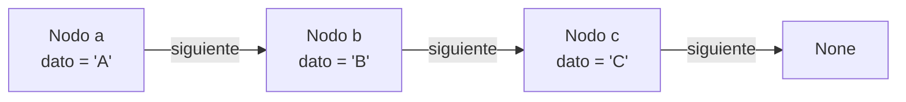
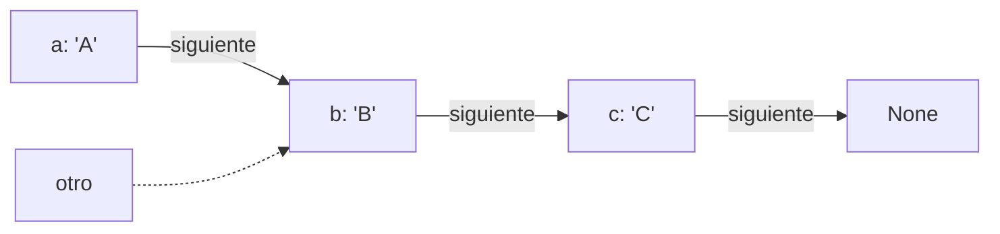
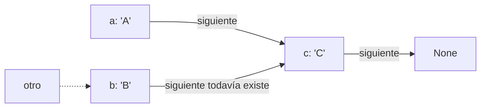
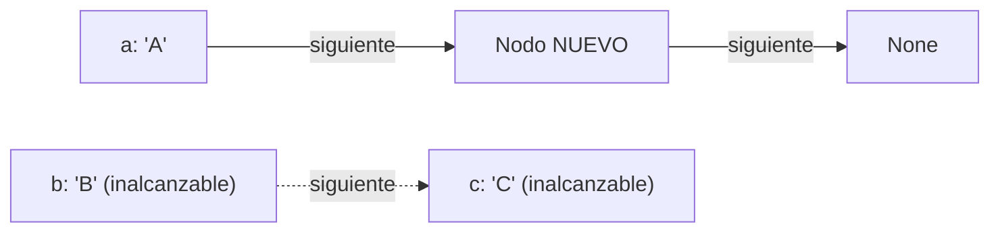

# Parte A — La cadena a mano

Antes de escribir `ListaEnlazada`, se construye una cadena de tres nodos
**sin ninguna abstracción de lista**: solo objetos `Nodo` conectados a mano
con el atributo `siguiente`.

### 1. Código usado.

```python
from nodo import Nodo

# Construye la cadena
c = Nodo("C")
b = Nodo("B", c)
a = Nodo("A", b)

# Recorrido con un bucle, sin abstracción de lista
actual = a
while actual is not None:
    print(actual.dato)
    actual = actual.siguiente
# Imprime: A, B, C
```

Cada `Nodo` se crea de atrás hacia adelante (`c`, luego `b`, luego `a`)
porque el constructor de un nodo necesita conocer de una vez cuál es su
`siguiente`. Si se creara `a` primero, no habría todavía ningún nodo al
cual apuntar.

### 2. Diagrama: cómo queda la cadena después de construirla



Tres variables de Python (`a`, `b`, `c`) apuntan cada una a su propio
nodo, y además cada nodo apunta al siguiente mediante su atributo
`siguiente`. La cadena completa es alcanzable desde `a` recorriendo
`siguiente` dos veces.

### 3. Recorrido con el bucle

| Paso | `actual` | `actual.dato` impreso | `actual.siguiente` (próximo `actual`) |
|------|----------|------------------------|----------------------------------------|
| 1    | `a`      | "A"                     | `b`                                      |
| 2    | `b`      | "B"                     | `c`                                      |
| 3    | `c`      | "C"                     | `None`                                   |
| 4    | `None`   | (el bucle termina)      | —                                         |


### 4. Qué pasa si se reasigna el enlace de `a` ANTES de guardar `b`

Este es el experimento central de la actividad. Se parte de la misma
cadena `a -> b -> c -> None` y se ejecuta:

```python
otro = b            # una segunda variable también apunta al nodo B
a.siguiente = c      # se reengancha "a" para saltar a "c" directamente
```

### Diagrama ANTES de la reasignación



### Diagrama DESPUÉS de `a.siguiente = c`



**El nodo `B` no se destruye** porque la variable `otro` lo sigue
referenciando: en Python un objeto solo se recolecta cuando *ninguna*
variable ni atributo lo referencia. `b.siguiente` sigue apuntando a `c`,
simplemente ya nadie **recorre** a través de `b` para llegar a `c`
porque el camino desde `a` ahora lo evita.

Si después se hace `otro = None`, ahí sí desaparece la última
referencia a `B` y Python lo recolecta.

### La pérdida de referencia real: reasignar el enlace SIN guardar una copia

El caso peligroso es cuando se
reasigna `a.siguiente` **antes** de haber guardado en algún lado el
valor viejo de `a.siguiente`, y no queda ninguna otra variable
apuntando al resto de la cadena:

```python
c = Nodo("C")
b = Nodo("B", c)
a = Nodo("A", b)

a.siguiente = Nodo("NUEVO")   # se pierde el único puntero a 'b'
```



Aquí `b` y `c` siguen existiendo como objetos en memoria por una
fracción de segundo, pero **ninguna variable del programa puede volver
a alcanzarlos**: se perdió la única flecha que llevaba desde `a` hacia
ellos. Python los recolecta como basura poco después.

**Esta es exactamente la razón detrás del orden en `_insertar_en_medio`
y `_eliminar_no_primero` de `ListaEnlazada`:**

- Al insertar en medio, primero se hace `nuevo.siguiente = anterior.siguiente`
  y *después* `anterior.siguiente = nuevo`. Si se hiciera al revés, en el
  instante en que se ejecuta `anterior.siguiente = nuevo` se perdería la
  única referencia al resto de la cadena antes de habérsela copiado al
  nodo nuevo.
- Al eliminar, primero se lee `objetivo = anterior.siguiente` y se
  guarda antes de reengancharlo (`anterior.siguiente = objetivo.siguiente`).
  Guardar la referencia al nodo objetivo antes de mover el enlace es lo
  que permite devolver `objetivo.dato` al final sin haberlo perdido.

## Conclusión de la Parte A

Una lista enlazada no es más que esto: nodos sueltos conectados por un
atributo `siguiente`, y toda su lógica se reduce a decidir **en qué
orden** se leen y se reescriben esos punteros. El orden equivocado no
lanza un error inmediato, el programa sigue corriendo, pero dejar
inalcanzable el resto de la cadena es un error silencioso que solo se
nota cuando se intenta recorrer o contar los elementos restantes.
